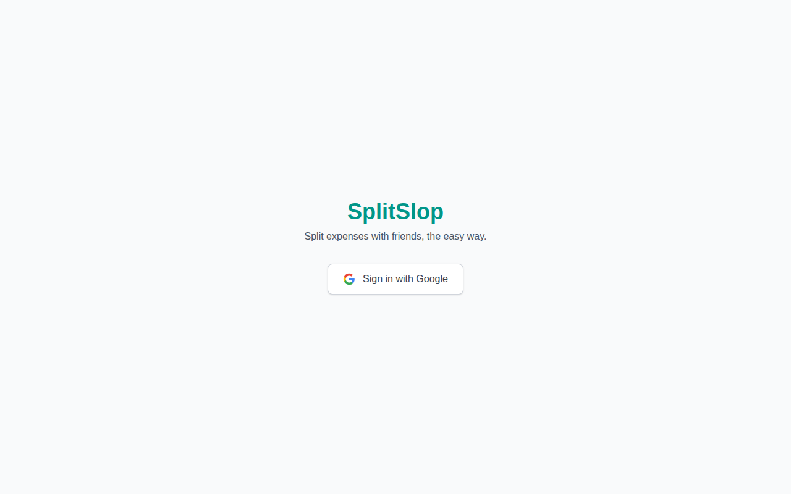
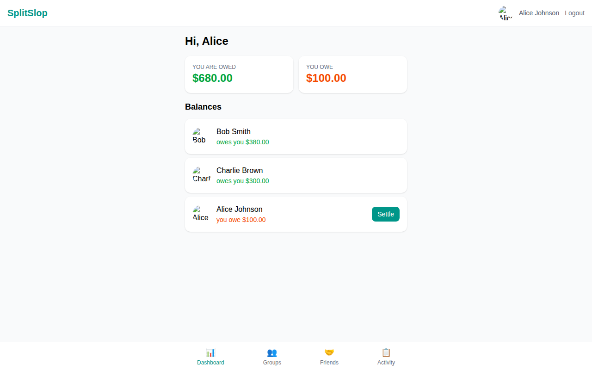
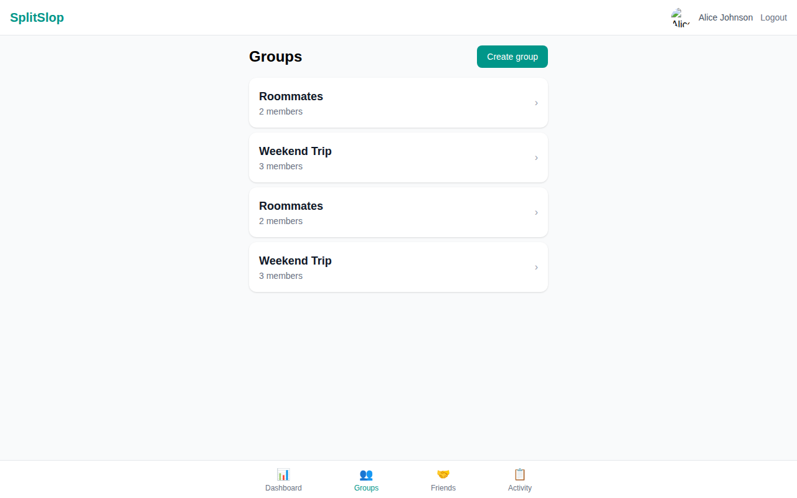
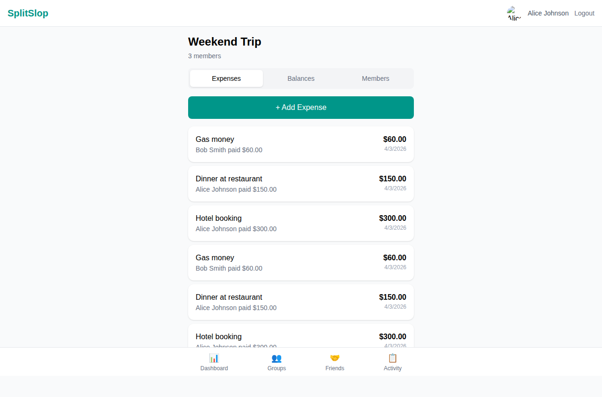
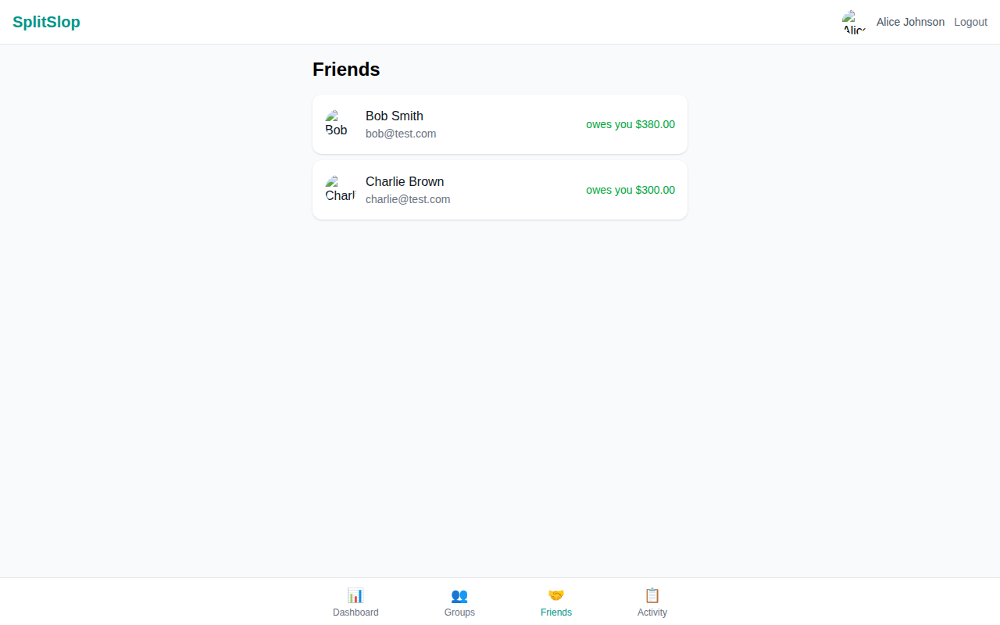
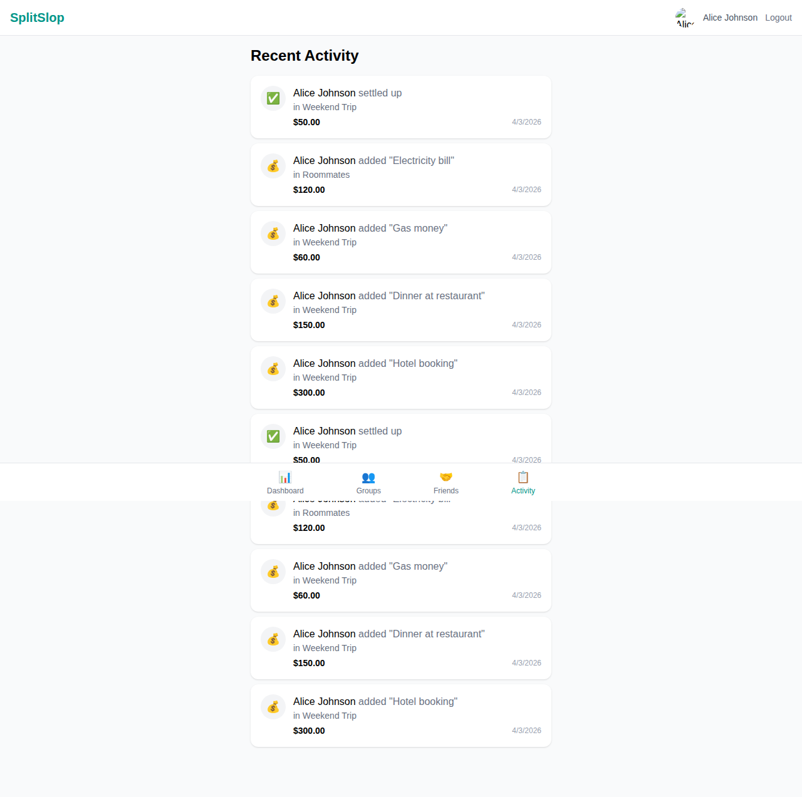
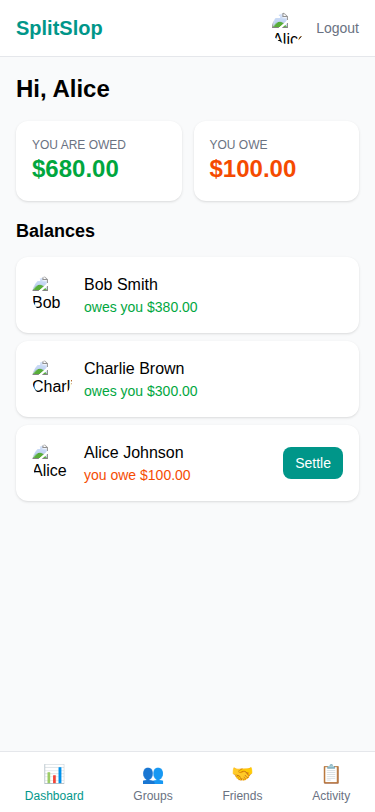

# SplitSlop - Expense Sharing App

A free, self-hosted Splitwise alternative for sharing expenses with friends. Supports group-based and 1-on-1 expense splitting with Google SSO authentication.

## Screenshots

| Login | Dashboard | Groups |
|-------|-----------|--------|
|  |  |  |

| Group Detail | Friends | Activity |
|-------------|---------|----------|
|  |  |  |

| Mobile View |
|-------------|
|  |

## Tech Stack

- **Frontend**: React 19 + Vite 8 + Tailwind CSS 4 + React Router 7
- **Backend**: Node.js + Express 4 + Passport.js
- **Database**: PostgreSQL 16 (Neon for production)
- **Auth**: Google OAuth 2.0 + JWT
- **Hosting**: Vercel (frontend) + Render (backend) + Neon (database) - all free tiers

## Features

- Google SSO login
- Create expense groups with multiple members
- Add expenses with equal or exact-amount splits
- Track balances per friend and per group
- Settle up debts between users
- Activity feed showing all expense and settlement history
- Friend list with balance summaries
- 1-on-1 expense tracking between any two users
- Responsive mobile-friendly UI

## Project Structure

```
splitwise-slop/
├── client/                 # React frontend (ESM)
│   ├── src/
│   │   ├── components/     # Navbar, AddExpenseModal, SettleUpModal
│   │   ├── context/        # AuthContext (JWT + Google OAuth)
│   │   ├── pages/          # Dashboard, Groups, GroupDetail, Friends, FriendDetail, Activity, Login
│   │   ├── __tests__/      # Vitest + React Testing Library tests
│   │   ├── api.js          # Axios instance with auth interceptor
│   │   ├── App.jsx         # Router setup
│   │   └── main.jsx        # Entry point
│   ├── eslint.config.js
│   ├── vite.config.js      # Includes Vitest config
│   └── package.json
├── server/                 # Express backend (CommonJS)
│   ├── routes/             # auth, groups, expenses, balances, settlements, friends, activity
│   ├── middleware/          # JWT auth middleware
│   ├── db/                 # PostgreSQL pool + migration script
│   ├── __tests__/          # Jest + Supertest integration tests
│   ├── app.js              # Express app (exported for testing)
│   ├── index.js            # Server entry point
│   ├── eslint.config.mjs
│   └── package.json
├── screenshots/            # App screenshots
├── .prettierrc             # Shared Prettier config
├── .prettierignore
└── .gitignore
```

---

## Local Development

### Prerequisites

- [Bun](https://bun.sh) 1.0+ (or Node.js 18+)
- PostgreSQL 16+ running locally
- Google OAuth credentials from [Google Cloud Console](https://console.cloud.google.com/apis/credentials)

### Setup

1. **Clone and install dependencies:**

```bash
git clone <repo-url> && cd splitwise-slop
cd client && bun install
cd ../server && bun install
```

2. **Configure environment variables:**

```bash
cp server/.env.example server/.env
```

Edit `server/.env` with your values:

```env
DATABASE_URL=postgresql://postgres@localhost:5432/splitwise_dev
JWT_SECRET=your-secret-key
GOOGLE_CLIENT_ID=your-google-client-id
GOOGLE_CLIENT_SECRET=your-google-client-secret
CLIENT_URL=http://localhost:5173
PORT=3001
```

3. **Create the database and run migrations:**

```bash
createdb splitwise_dev
cd server && bun run migrate
```

4. **Start development servers:**

```bash
# Terminal 1 - Backend (with auto-reload)
cd server && bun run dev

# Terminal 2 - Frontend (with HMR)
cd client && bun run dev
```

The frontend runs on `http://localhost:5173` and proxies `/api` and `/auth` requests to the backend on port 3001.

---

## Development Guidelines

### Code Style

The project uses **ESLint** for linting and **Prettier** for formatting. A shared `.prettierrc` at the project root ensures consistent formatting across both client and server.

**Prettier config** (`singleQuote: true`, `trailingComma: "es5"`).

#### Client (ESM / React)

- ESLint 9 flat config with `react-hooks`, `react-refresh`, and `eslint-config-prettier`
- Browser globals, JSX support

#### Server (CommonJS / Node.js)

- ESLint 9 flat config (`eslint.config.mjs`) with Node.js globals and `sourceType: "commonjs"`
- Unused function args prefixed with `_` are allowed (`argsIgnorePattern: '^_'`)

### Running Linters and Formatters

```bash
# Client
cd client
bun run lint          # ESLint check
bun run format:check  # Prettier check (no changes)
bun run format        # Prettier auto-fix

# Server
cd server
bun run lint          # ESLint check
bun run format:check  # Prettier check (no changes)
bun run format        # Prettier auto-fix
```

All lint and format checks must pass before committing. Run both to verify:

```bash
cd client && bun run lint && bun run format:check
cd ../server && bun run lint && bun run format:check
```

### Architecture Notes

- **`server/app.js`** exports the Express app without calling `listen()`, so it can be imported by Supertest for integration testing.
- **`server/index.js`** imports the app and starts the HTTP server. Only used as the entry point.
- **`server/db/pool.js`** creates a single `pg.Pool` instance from `DATABASE_URL`. All routes share this pool.
- **`client/src/api.js`** creates an Axios instance that automatically attaches the JWT from `localStorage` and handles 401 responses by redirecting to login.

---

## Testing

### Test Stack

| Layer | Framework | Runner | Coverage |
|-------|-----------|--------|----------|
| **Server** | Jest + Supertest | `bun test` | v8 via Jest |
| **Client** | Vitest + React Testing Library | `bun test` | v8 via Vitest |

### Running Tests

```bash
# Server tests (requires PostgreSQL running locally)
cd server
bun test
```

Server tests use a real PostgreSQL database (`splitwise_test`). The test setup (`__tests__/setup.js`) automatically:
- Creates the `splitwise_test` database
- Runs the full schema migration
- Seeds test users and generates JWT tokens
- Cleans up after all tests complete

```bash
# Client tests (no external dependencies)
cd client
bun test
```

Client tests run in jsdom with all API calls mocked. No running server or database needed.

### Test Coverage

Both projects are configured to output coverage reports when running `bun test`.

**Coverage targets: >= 60% line coverage for both client and server.**

Current coverage:
- **Server**: ~82% line coverage (33 tests across 7 test files)
- **Client**: ~69% line coverage (37 tests across 13 test files)

#### Server Test Files

| File | What it tests |
|------|---------------|
| `auth.test.js` | JWT middleware, `/auth/me` endpoint |
| `groups.test.js` | Group CRUD, member management |
| `expenses.test.js` | Expense creation (equal + exact split), update, delete |
| `balances.test.js` | Balance calculations, settlement effects |
| `settlements.test.js` | Settlement recording and listing |
| `friends.test.js` | Friends list, user search |
| `activity.test.js` | Activity feed |

#### Client Test Files

| File | What it tests |
|------|---------------|
| `api.test.js` | Axios interceptors, auth header, 401 handling |
| `AuthContext.test.jsx` | Auth state management, login/logout flow |
| `Login.test.jsx` | Login page rendering, Google SSO link |
| `Navbar.test.jsx` | Navigation tabs, active state, logout |
| `Dashboard.test.jsx` | Balance summary cards, balance list |
| `Groups.test.jsx` | Group list, create group form |
| `GroupDetail.test.jsx` | Group detail tabs, expenses, members |
| `Friends.test.jsx` | Friends list with balances |
| `FriendDetail.test.jsx` | 1-on-1 expense history |
| `Activity.test.jsx` | Activity feed rendering |
| `AddExpenseModal.test.jsx` | Expense form, split types |
| `SettleUpModal.test.jsx` | Settlement form |
| `App.test.jsx` | Routing, auth protection |

### Writing New Tests

**Server tests**: Use Supertest against the exported Express app. Import helpers from `__tests__/setup.js` for database pool, user IDs, and JWT tokens.

```js
const request = require('supertest');
const app = require('../app');
const { getToken, getUser } = require('./setup');

describe('GET /api/your-endpoint', () => {
  it('returns data for authenticated user', async () => {
    const res = await request(app)
      .get('/api/your-endpoint')
      .set('Authorization', `Bearer ${getToken(0)}`);
    expect(res.status).toBe(200);
  });
});
```

**Client tests**: Use React Testing Library with `vi.mock` for API calls. Wrap components in `MemoryRouter` and provide auth context as needed.

```jsx
import { render, screen } from '@testing-library/react';
import { MemoryRouter } from 'react-router-dom';
import YourComponent from '../pages/YourComponent';

vi.mock('../api', () => ({
  default: { get: vi.fn(), post: vi.fn() },
}));

test('renders correctly', async () => {
  api.get.mockResolvedValueOnce({ data: [...] });
  render(
    <MemoryRouter>
      <YourComponent />
    </MemoryRouter>
  );
  expect(await screen.findByText('Expected Text')).toBeInTheDocument();
});
```

### Verification Checklist

Before submitting changes, run through this checklist:

```bash
# 1. Lint both projects
cd client && bun run lint && cd ../server && bun run lint

# 2. Format check both projects
cd client && bun run format:check && cd ../server && bun run format:check

# 3. Run server tests (requires PostgreSQL)
cd server && bun test

# 4. Run client tests
cd client && bun test

# 5. Verify the frontend builds without errors
cd client && bun run build

# 6. Manual smoke test
cd server && bun run dev &     # Start backend
cd client && bun run dev &     # Start frontend
# Visit http://localhost:5173 and verify:
#   - Login page loads with Google sign-in button
#   - After auth: dashboard shows balances
#   - Can create groups and add members
#   - Can add expenses (equal and exact split)
#   - Can settle up debts
#   - Friends page shows contacts with balances
#   - Activity feed shows recent actions
#   - Navigation between all pages works
#   - Mobile responsive layout works (resize browser to ~375px)
```

---

## API Endpoints

All API routes require a valid JWT in the `Authorization: Bearer <token>` header (except `/auth/google` and `/health`).

| Method | Endpoint | Description |
|--------|----------|-------------|
| GET | `/health` | Health check |
| GET | `/auth/google` | Initiate Google OAuth |
| GET | `/auth/google/callback` | OAuth callback |
| GET | `/auth/me` | Get current user |
| GET | `/api/groups` | List user's groups |
| POST | `/api/groups` | Create a group |
| GET | `/api/groups/:id` | Get group details + members |
| POST | `/api/groups/:id/members` | Add member by email |
| DELETE | `/api/groups/:id/members/:userId` | Remove member |
| POST | `/api/expenses` | Create expense with splits |
| GET | `/api/expenses/group/:groupId` | List group expenses |
| GET | `/api/expenses/between/:userId` | List 1-on-1 expenses |
| PUT | `/api/expenses/:id` | Update expense |
| DELETE | `/api/expenses/:id` | Delete expense |
| GET | `/api/balances` | Get overall balances |
| GET | `/api/balances/group/:groupId` | Get group balances |
| POST | `/api/settlements` | Record a settlement |
| GET | `/api/settlements/group/:groupId` | List group settlements |
| GET | `/api/friends` | List friends |
| GET | `/api/friends/search?email=` | Search users by email |
| GET | `/api/activity` | Get activity feed |

---

## Deployment

See **[DEPLOYMENT.md](DEPLOYMENT.md)** for the full step-by-step deployment guide covering Neon, Render, Vercel, and Google OAuth setup.

Quick summary:

1. **Neon** — Create a free PostgreSQL database and run migrations
2. **Google OAuth** — Create OAuth credentials in Google Cloud Console
3. **Render** — Deploy the backend with environment variables
4. **Vercel** — Deploy the frontend with `VITE_API_URL` pointing to Render
5. **Wire together** — Set `CLIENT_URL` on Render and add the OAuth redirect URI in Google

---

## License

MIT
